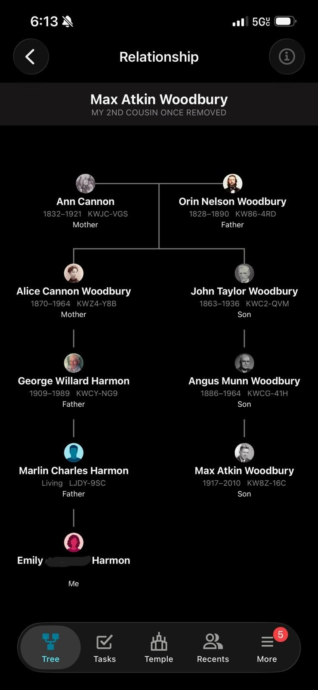

After seeing on Wikipedia that [M. A. Woodbury](https://en.wikipedia.org/wiki/Max_A._Woodbury) was born in St. George Utah using [familysearch.org](https://www.familysearch.org) I discovered that he is my father-in-law's second cousin. My wife's relation is below, and the wikipedia page on the Woodbury matrix identity can be found [here](https://en.wikipedia.org/wiki/Woodbury_matrix_identity)

